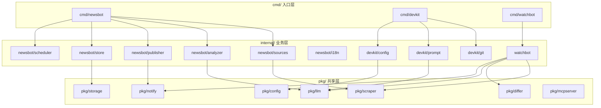

# 系统架构设计

## 1. 整体架构

DevKit Suite 采用 Go Monorepo 架构，通过共享包（`pkg/`）实现代码复用，各产品（`cmd/` + `internal/`）独立部署。

```
                    ┌──────────────────────────────────┐
                    │         外部服务                   │
                    │  ┌──────┐ ┌────────┐ ┌─────────┐ │
                    │  │OpenAI│ │Telegram│ │Hacker   │ │
                    │  │Gemini│ │Bot API │ │News API │ │
                    │  │Claude│ │  SMTP  │ │RSS Feeds│ │
                    │  │Ollama│ │ (Email)│ │(8 源)   │ │
                    │  │MiniMax││        │ │         │ │
                    │  └──┬───┘ └───┬────┘ └────┬────┘ │
                    └─────┼─────────┼───────────┼──────┘
                          │         │           │
    ┌─────────────────────┼─────────┼───────────┼──────────────────┐
    │  DevKit Suite        │         │           │                  │
    │                      │         │           │                  │
    │  ┌─────────┐  ┌──────▼──┐  ┌──▼───┐  ┌───▼──────┐          │
    │  │ DevKit  │  │  LLM    │  │Notify│  │ Scraper  │          │
    │  │ CLI     │  │ Client  │  │      │  │          │          │
    │  │         │  │(pkg/llm)│  │(pkg/ │  │(pkg/     │          │
    │  │commit   │──▶         │  │notify│  │scraper)  │          │
    │  │review   │  │ 4 提供商│  │)     │  │          │          │
    │  └─────────┘  └────┬────┘  └──┬───┘  └────┬─────┘          │
    │                     │          │           │                  │
    │  ┌─────────┐  ┌────▼────┐  ┌──▼───┐  ┌───▼──────┐          │
    │  │WatchBot │──▶ Differ  │──▶      │──▶ Storage  │          │
    │  │ Monitor │  │(pkg/    │  │Alert │  │(pkg/     │          │
    │  │         │  │differ)  │  │      │  │storage)  │          │
    │  └─────────┘  └─────────┘  └──────┘  └──────────┘          │
    │                                                              │
    │  ┌─────────┐  ┌─────────┐                                   │
    │  │NewsBot  │  │  MCP    │                                   │
    │  │ Daily   │  │ Server  │                                   │
    │  │ Digest  │  │Template │                                   │
    │  └─────────┘  └─────────┘                                   │
    └──────────────────────────────────────────────────────────────┘
```

## 2. 包依赖关系



## 3. 数据流

### 3.1 NewsBot 数据流

```
RSS/HN API  ──▶  Sources  ──▶  Articles[]  ──▶  LLM Analyzer  ──▶  DailyDigest (zh)
                                    │                                     │
                                    ▼                                     ▼
                              SQLite Store                        i18n Translator
                                                                (并行翻译 5 语言)
                                                                       │
                                                                       ▼
                                                            map[lang]*DailyDigest
                                                                       │
                                                                       ▼
                                                                Publisher
                                                          (按订阅者语言分发邮件)
```

### 3.2 DevKit 数据流

```
git diff  ──▶  Truncate  ──▶  Prompt Template  ──▶  LLM  ──▶  Commit/Review
   │                                                              │
   ▼                                                              ▼
Staged                                                    Interactive
Files                                                     Confirm
```

### 3.3 WatchBot 数据流

```
Target URL  ──▶  Scraper  ──▶  Clean Text  ──▶  Differ  ──▶  ChangeAlert
                                    │             │               │
                                    ▼             ▼               ▼
                           Snapshot Cache    LLM Analyze     Notify
```

## 4. 核心设计决策

### 4.1 Monorepo vs 多仓库

选择 **Monorepo** 的理由：

- 4 个产品共享 7 个底层包，代码复用率 > 60%
- 统一版本管理、统一 CI/CD
- 跨产品重构时原子提交

### 4.2 LLM 抽象层

`pkg/llm` 统一封装了 5 家 LLM 提供商的接口差异：

```go
type Client interface {
    Generate(ctx, req) (*Response, error)    // 文本生成
    GenerateJSON(ctx, req, out) error        // 结构化 JSON 输出
    Provider() Provider
    Close() error
}
```

**设计要点：**

- `Config.Provider` 决定实例类型（工厂模式）
- 可选 RetryWrapper（指数退避 + 错误分类）
- `EstimateCost()` 基于 token 计费模型估价

### 4.3 MCP 框架提取

从 npinterface-mcp 提取的核心差异：

| 维度 | npinterface-mcp | pkg/mcpserver |
|------|----------------|---------------|
| 工具绑定 | `Execute(client, args)` | `Execute(args)` |
| 依赖 | 绑定 `np.Client` | 无外部依赖 |
| 中间件 | 无 | Middleware 链 |
| 传输 | stdio + HTTP (硬编码) | stdio / HTTP (可选) |
| 日志 | glog | log/slog |

### 4.4 存储策略

| 产品 | MVP 存储 | 生产建议 |
|------|----------|----------|
| NewsBot | SQLite (WAL mode) | PostgreSQL |
| DevKit | 无持久化 | 可选 SQLite |
| WatchBot | 内存 Cache | SQLite → PostgreSQL |

### 4.5 通知层

`pkg/notify` 采用 Dispatcher 模式：

```go
dispatcher := notify.NewDispatcher()
dispatcher.Register(telegramNotifier)
dispatcher.Register(webhookNotifier)
dispatcher.SendAll(ctx, msg)  // 广播到所有注册通道
```

支持扩展：实现 `Notifier` 接口即可添加新通道（邮件、Slack、企业微信等）。

## 5. 安全考虑

| 场景 | 措施 |
|------|------|
| API Key 存储 | 环境变量 / `.devkit.yaml`（gitignore） |
| HTTP 传输 | CORS 中间件 + Bearer Token |
| MCP Session | 服务端随机 ID 生成 + 映射表验证 |
| Diff 输入 | 截断大 Diff（15KB/20KB 上限） |
| 依赖安全 | 纯 Go SQLite（无 CGO），最小化外部依赖 |
