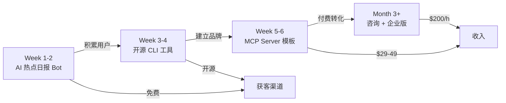

# 🧠 轻量化产品方向脑暴

## ⚠️ 先说股票推荐 Agent — 强烈不建议

> [!CAUTION]
> **在中国做股票推荐产品有严重法律风险，个人开发者千万不要碰。**

### 法律红线

| 风险 | 说明 |
|------|------|
| **非法荐股** | 根据《证券、期货投资咨询管理暂行办法》，个人未持牌提供股票推荐属于**违法行为** |
| **刑事风险** | 2024-2025 年多起案例：**最高判 2 年 4 个月有期徒刑**，**罚款最高 1300 万元** |
| **定义宽泛** | 即使包装成"课程"、"会员"、"AI 工具"，只要输出涉及具体股票买卖建议 → 违法 |
| **AI 加重审查** | 2025-2026 年金融监管总局正在专门制定 AI+金融 监管政策，智能投顾必须持牌 |

### 即使做海外市场

- 美国 SEC 对投资建议也有严格监管（需 RIA 注册）
- LLM 产生的投资建议如果用户亏损 → 法律纠纷风险极高
- 准确率不够高 → 用户亏钱 → 差评+退款+可能的诉讼

### 如果真想做金融方向（安全的变体）

| 方案 | 合规性 | 说明 |
|------|--------|------|
| ✅ **热点事件追踪器**（只展示事件，不推荐股票） | 安全 | "今天 NVIDIA 发布新 GPU" — 纯信息聚合 |
| ✅ **财报分析助手**（分析公开数据，不给买卖建议） | 较安全 | 帮用户读财报，不说"该买"或"该卖" |
| ⚠️ **回测工具**（历史数据分析，用户自己做决策） | 灰色 | 提供工具但不提供建议 |
| ❌ **股票推荐机器人** | 违法 | 无论 AI 还是人工，个人不可做 |

---

## 🎯 真正推荐的 10 个轻量方向

按照**启动成本低 → 高**排序，每个都标注了核心数据：

---

### 1. 🔥 AI 热点日报/周报 Bot（最轻量，今天就能开始）

```
启动成本: $0    技术难度: ⭐    变现速度: 2-4周    天花板: $3,000/月
```

**做什么**：每天自动抓取 AI 领域热点（新模型发布、API 变更、论文、开源项目），用 LLM 生成结构化摘要，推送到 Telegram/微信群/邮件。

**为什么好**：

- 你自己就需要这个，是真实痛点
- 零运维成本，cron job + LLM API 搞定
- 用户量 = 推广渠道（转发）
- 变现方式：广告赞助 / 付费深度版 / 引流到其他产品

**MVP**：一个 Go 脚本 + Telegram Bot，每天 8:00 发送 AI 行业日报。

---

### 2. 📋 Prompt 模板市场（低门槛卖数字产品）

```
启动成本: $0    技术难度: ⭐    变现速度: 1-2周    天花板: $5,000/月
```

**做什么**：整理、测试、优化高质量 Prompt 模板，按场景分类（编程/写作/分析/客服），通过 Gumroad 或独立站售卖。

**为什么好**：

- 不需要写代码，纯内容产品
- 你有大量实战 Prompt 经验（robotIM 的 system prompt、tool 选择 prompt）
- 边际成本为零
- 可以搭配视频教程一起卖

**变现**：单个模板包 $5-19，全套 $49-99。

---

### 3. 🛠️ 开发者 CLI 工具（开源 + 付费 Pro）

```
启动成本: $0    技术难度: ⭐⭐    变现速度: 4-8周    天花板: $10,000/月
```

**做什么**：做一个 Go CLI 工具，解决开发者日常高频痛点，例如：

- **`ai-commit`** — 自动生成 git commit message
- **`ai-review`** — 自动 code review 一个 PR
- **`ai-doc`** — 自动从代码生成 API 文档
- **`ai-test`** — 自动生成单元测试

**为什么好**：

- Go 编译成单二进制文件，分发极其方便
- CLI 工具在 GitHub 上最容易获 Star
- 免费版引流，Pro 版收费（更多模型、团队功能）

**MVP**：先做 `ai-commit`，npm/brew 分发，GitHub 开源。

---

### 4. 🤖 MCP Server 模板 / Boilerplate（你的独特优势）

```
启动成本: $0    技术难度: ⭐⭐    变现速度: 2-4周    天花板: $8,000/月
```

**做什么**：提供开箱即用的 MCP Server 模板（Go 版本），包含：

- SSE transport 实现
- Session 管理
- Tool 注册框架
- 动态发现
- 部署脚本（Docker）

**为什么好**：

- MCP 生态刚起步，Go 语言的 MCP 实现几乎空白
- 你已经有完整的生产级实现（robotIM）
- 可以卖模板 + 视频教程 + 咨询服务
- 开发者付费意愿强

**变现**：模板 $29-49，视频教程 $99，咨询 $200/小时。

---

### 5. 📊 竞品价格/功能监控 Bot

```
启动成本: $10/月    技术难度: ⭐⭐    变现速度: 4-6周    天花板: $15,000/月
```

**做什么**：帮 SaaS 公司监控竞争对手的价格页面、功能页面变化，一有变更立即通知。

**为什么好**：

- 比 API Change Sentinel 市场更大（所有 SaaS 公司都需要）
- 技术栈完全一样（爬虫 + diff + LLM 分析）
- 企业付费意愿强（$49-99/月）
- 不受监管限制

**和 API Change Sentinel 的区别**：盯的是竞品官网，不是 API 文档。用户是产品经理和 CEO，不是开发者。

---

### 6. 📝 会议纪要 AI + 待办提取

```
启动成本: $20/月    技术难度: ⭐⭐⭐    变现速度: 4-8周    天花板: $20,000/月
```

**做什么**：上传会议录音 → AI 自动生成纪要 + 提取 Action Items + 分配负责人 + 发送提醒。

**为什么好**：

- 巨大的企业市场，每个团队每天都开会
- Otter.ai 的竞争对手但可以做垂直（比如只做中文市场）
- 技术上 Whisper + LLM 就能搞定

---

### 7. 🔍 GitHub Star 分析 + 趋势预测工具

```
启动成本: $0    技术难度: ⭐⭐    变现速度: 4-8周    天花板: $5,000/月
```

**做什么**：分析 GitHub 仓库的 Star 增长趋势、贡献者活跃度、Issue 响应速度，帮投资人/开发者评估开源项目健康度。

**为什么好**：

- GitHub API 免费
- 开发者和 VC 都需要
- 可以先做免费的 Twitter Bot 发趋势报告来引流

---

### 8. 💬 智能客服知识库生成器

```
启动成本: $10/月    技术难度: ⭐⭐⭐    变现速度: 6-10周    天花板: $30,000/月
```

**做什么**：用户上传产品文档/FAQ → 自动生成向量知识库 → 提供可嵌入网站的客服聊天窗口。

**为什么好**：

- 你的 robotIM 就是完整的聊天+AI 系统
- 小企业不会自己搭 RAG，但愿意为此付费
- 按条回复计费 / 月费模式

---

### 9. 🌐 多语言 README / 文档翻译工具

```
启动成本: $0    技术难度: ⭐⭐    变现速度: 2-4周    天花板: $8,000/月
```

**做什么**：GitHub Action / CLI，自动将 README 和文档翻译成多种语言，保持格式和链接不变。

**为什么好**：

- 开源社区刚需（中英日韩）
- 可以做成 GitHub Marketplace App
- 技术简单，LLM + Markdown 解析

---

### 10. 📈 SaaS 指标仪表盘（个人版）

```
启动成本: $10/月    技术难度: ⭐⭐⭐    变现速度: 6-10周    天花板: $15,000/月
```

**做什么**：帮独立开发者/小团队一键聚合 Stripe 收入、Google Analytics 流量、Twitter 粉丝增长等数据到一个简洁仪表盘。

**为什么好**：

- 独立开发者社区是精准用户群
- 现有方案（Baremetrics）太贵
- 每对接一个数据源 = 一个付费功能

---

## 📊 全部方向对比矩阵

| # | 方向 | 启动成本 | 技术难度 | 竞争 | 变现速度 | 天花板/月 | 推荐度 |
|---|------|---------|---------|------|---------|----------|-------|
| 1 | AI 热点日报 Bot | $0 | ⭐ | 低 | 🟢 快 | $3K | ⭐⭐⭐⭐ |
| 2 | Prompt 模板市场 | $0 | ⭐ | 中 | 🟢 快 | $5K | ⭐⭐⭐ |
| 3 | 开发者 CLI 工具 | $0 | ⭐⭐ | 中 | 🟡 中 | $10K | ⭐⭐⭐⭐⭐ |
| 4 | MCP Server 模板 | $0 | ⭐⭐ | 🟢 极低 | 🟡 中 | $8K | ⭐⭐⭐⭐⭐ |
| 5 | 竞品监控 Bot | $10 | ⭐⭐ | 中 | 🟡 中 | $15K | ⭐⭐⭐⭐ |
| 6 | 会议纪要 AI | $20 | ⭐⭐⭐ | 高 | 🟡 中 | $20K | ⭐⭐⭐ |
| 7 | GitHub 趋势分析 | $0 | ⭐⭐ | 低 | 🟡 中 | $5K | ⭐⭐⭐ |
| 8 | 智能客服知识库 | $10 | ⭐⭐⭐ | 高 | 🔴 慢 | $30K | ⭐⭐⭐ |
| 9 | 多语言文档翻译 | $0 | ⭐⭐ | 低 | 🟢 快 | $8K | ⭐⭐⭐⭐ |
| 10 | SaaS 指标仪表盘 | $10 | ⭐⭐⭐ | 中 | 🔴 慢 | $15K | ⭐⭐⭐ |

---

## 🏆 我最推荐的 Top 3 组合

> [!TIP]
> **核心原则：用免费产品获客，用付费产品变现，用技术壁垒构建护城河。**

### 🥇 推荐组合：CLI 工具 + MCP 模板 + 热点日报



**为什么这个组合最好？**

1. **热点日报** = 零成本获客引擎，每天帮你触达目标用户
2. **CLI 工具** = 在 GitHub 建立开发者品牌和信任
3. **MCP 模板** = 真正的付费产品，利用你的独特技术优势
4. **三者相互引流**，形成飞轮

### ⏱️ 第一步行动清单

| 今天就做 | 本周做完 | 下周做完 |
|---------|---------|---------|
| 1. 注册 Telegram Bot | 3. 写爬虫脚本抓 5 个 AI 新闻源 | 5. 开源 `ai-commit` CLI |
| 2. 写 LLM 摘要 prompt | 4. 设置 cron 每天 8:00 推送 | 6. 发 Reddit + Twitter |

---

## ⚡ 关于"信息差"的思考

你提到想**打信息差**，这是关键洞察。真正的信息差不在于"我知道你不知道"，而在于：

| 信息差类型 | 例子 | 变现方式 |
|-----------|------|---------|
| **时间差** | 你比别人早 2 小时知道 API 变更 | Sentinel / 日报 |
| **理解差** | 你能看懂别人看不懂的技术文档 | 咨询 / 教程 |
| **整合差** | 你把 10 个来源整合成 1 个结论 | 报告 / Newsletter |
| **实现差** | 你能把想法变成产品别人不能 | SaaS / 工具 |

> **你最大的信息差 = 实现差**。你能用 Go 写生产级的 MCP 系统、Agent 循环、多模态处理——大部分人只能看教程。把这个能力产品化。
