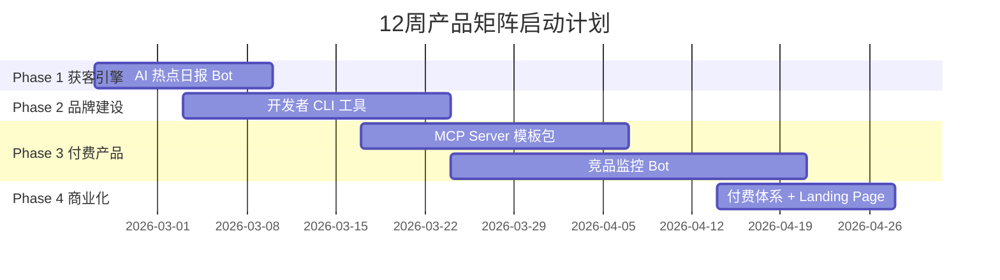
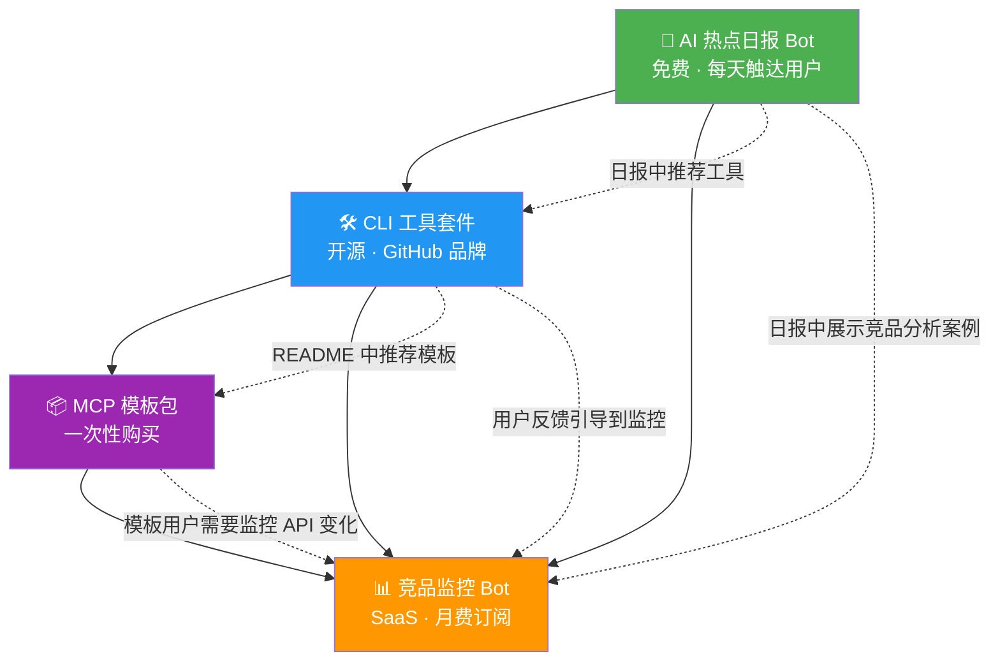

# 🚀 四大产品商业化落地方案

> 四个产品不是各自独立的——它们共享技术栈、共享用户群、互相引流，形成**产品矩阵**。

## 总体策略：分阶段滚动启动



---

## 📦 产品 1：AI 热点日报 Bot

### 定位
**免费获客引擎**，为其他 3 个产品积累目标用户群。

### 具体做什么

每天自动生成一份 AI 行业简报，涵盖：
- 🆕 模型发布 / 更新（OpenAI、Anthropic、Google、Meta）
- ⚠️ API 变更 / 弃用通知
- 📦 热门开源项目（GitHub Trending）
- 💰 融资 / 收购新闻
- 📝 重要论文摘要

### 技术方案

```
数据源（5个起步）               处理              分发
┌─────────────────┐    ┌──────────────┐    ┌──────────────┐
│ GitHub Trending  │───▶│              │    │ Telegram Bot │
│ OpenAI Blog      │───▶│  Go 爬虫     │    │ 微信公众号    │
│ Anthropic News   │───▶│  +           │───▶│ Twitter/X    │
│ Google AI Blog   │───▶│  LLM 摘要    │    │ 邮件订阅     │
│ Hacker News      │───▶│              │    │ RSS          │
└─────────────────┘    └──────────────┘    └──────────────┘
```

### 第 1 周：逐日操作步骤

| 日 | 任务 | 产出 |
|---|------|------|
| **Day 1** | 创建 Telegram Bot（@BotFather），搭建 Go 项目骨架 | `cmd/newsbot/main.go` |
| **Day 2** | 写 5 个数据源爬虫（HTTP + goquery 解析） | `internal/scraper/` 目录 |
| **Day 3** | 写 LLM 摘要 prompt，调通 OpenAI/Gemini API | `internal/summarizer/` |
| **Day 4** | 拼装输出格式，接入 Telegram Bot API | 完整推送链路 |
| **Day 5** | 部署到 VPS/云函数 + cron 定时任务 | 每天 8:00 自动推送 |
| **Day 6** | 在 Reddit (r/ChatGPT, r/OpenAI) + Twitter 发帖宣传 | 第一批用户 |
| **Day 7** | 收集反馈，调整内容和频率 | 迭代 |

### 目录结构

```
newsbot/
├── cmd/newsbot/main.go           // 入口
├── internal/
│   ├── scraper/
│   │   ├── github_trending.go    // GitHub Trending 爬虫
│   │   ├── openai_blog.go        // OpenAI 博客
│   │   ├── anthropic_news.go     // Anthropic 新闻
│   │   ├── google_ai_blog.go     // Google AI 博客
│   │   └── hackernews.go         // Hacker News AI 分类
│   ├── summarizer/
│   │   ├── llm.go                // LLM 调用封装
│   │   └── prompt.go             // 摘要 Prompt 模板
│   ├── publisher/
│   │   ├── telegram.go           // Telegram Bot 推送
│   │   ├── twitter.go            // Twitter API
│   │   └── email.go              // 邮件推送
│   └── storage/
│       └── sqlite.go             // 历史记录去重
├── configs/config.yaml
├── Dockerfile
└── README.md
```

### 变现路径
```
免费版（积累用户）               付费版 $9/月
─────────────────              ──────────────
每天 1 条摘要                    完整日报 + 深度分析
5 个数据源                      20+ 数据源
仅 Telegram                     邮件 + Slack + 自定义 Webhook
无历史                          历史搜索 + 每周汇总
```

### 关键指标

| 指标 | 1 个月目标 | 3 个月目标 |
|------|-----------|-----------|
| Telegram 订阅 | 200 人 | 1000 人 |
| 邮件订阅 | 50 人 | 300 人 |
| 付费用户 | 0 | 30 人 |

---

## 📦 产品 2：开发者 CLI 工具套件

### 定位
**品牌建设 + 开源获客**，通过 GitHub 在开发者社群建立影响力。

### 产品差异化（为什么不怕 aicommits 的竞争）

| 维度 | aicommits (Node.js) | 你的工具 (Go) |
|------|---------------------|--------------|
| 安装 | `npm install -g` 需要 Node 环境 | **单二进制文件**，无依赖 |
| 速度 | 较慢 | 极快 |
| 多模型 | 主要 OpenAI | OpenAI + Gemini + Claude + Ollama 本地 |
| 功能 | 仅 commit message | **套件**：commit + review + doc + test |
| 中文 | 差 | 原生支持中英文 |

### 工具矩阵（每个都是独立的 CLI 命令）

```
devkit                             // 统一入口
├── devkit commit                  // AI 生成 commit message
├── devkit review                  // AI Code Review
├── devkit doc                     // 从代码生成 API 文档
├── devkit test                    // AI 生成单元测试
├── devkit changelog               // 从 git log 生成 CHANGELOG
└── devkit translate               // 翻译 README/文档
```

### 第 2-4 周：逐步开发

| 周 | 任务 | 产出 |
|---|------|------|
| **Week 2** | 搭建 CLI 框架 (cobra) + `devkit commit` 功能 | 可用的 commit 工具 |
| **Week 3** | 开发 `devkit review` + `devkit doc` | 3 个可用命令 |
| **Week 4** | 完善 README + 录 demo GIF + GitHub 发布 | brew/go install 可用 |

### `devkit commit` 核心逻辑

```go
// 伪代码流程
func CommitCommand() {
    // 1. 获取 staged diff
    diff := exec("git diff --staged")

    // 2. 读取最近 5 条 commit 学习风格
    recentCommits := exec("git log --oneline -5")

    // 3. 调用 LLM
    prompt := fmt.Sprintf(`
    基于以下 git diff 生成 commit message。
    遵循 Conventional Commits 格式。
    参考项目历史风格: %s

    Diff:
    %s
    `, recentCommits, diff)

    message := callLLM(prompt)

    // 4. 交互式确认
    confirm := promptUser("Use this message? " + message)
    if confirm {
        exec("git commit -m " + message)
    }
}
```

### 分发渠道

| 渠道 | 操作 |
|------|------|
| **Homebrew** | 创建 Tap：`brew install yourname/tap/devkit` |
| **go install** | `go install github.com/yourname/devkit@latest` |
| **GitHub Releases** | goreleaser 自动构建多平台二进制 |
| **AUR** | Linux 用户 |
| **Docker** | `docker run yourname/devkit commit` |

### 变现模式

```
免费版 (OSS)                      Pro 版 $12/月
──────────                       ─────────────
devkit commit                     ✅ 全部命令
devkit review (每天 5 次)          ✅ 无限次数
支持 OpenAI                       ✅ 全部模型
                                  ✅ 团队共享配置
                                  ✅ 自定义 Prompt 模板
                                  ✅ CI/CD 集成
```

**实现方式**：CLI 启动时检查 License Key（本地缓存），GitHub Sponsors 或 Paddle 收款。

---

## 📦 产品 3：MCP Server 模板包

### 定位
**高客单价付费产品**，利用你的独特技术优势。

### 为什么这是蓝海

| 现状 | 说明 |
|------|------|
| `mark3labs/mcp-go` | SDK 库，不是完整方案，开发者还需自己搭架构 |
| `metoro-io/mcp-golang` | 类似上面，只是工具包 |
| **你的差异** | **生产级完整方案**：SSE + Session + 动态发现 + 认证 + Docker + 文档 |

### 产品内容

```
mcp-server-template/
├── 🏗️ 核心框架
│   ├── transport/
│   │   ├── sse.go              // SSE 传输层（你已实现过）
│   │   ├── stdio.go            // stdio 传输
│   │   └── websocket.go        // WebSocket 传输
│   ├── session/
│   │   ├── manager.go          // Session 生命周期管理
│   │   └── store.go            // 内存/Redis Session 存储
│   ├── router/
│   │   ├── jsonrpc.go          // JSON-RPC 统一处理
│   │   └── method_registry.go  // 方法注册表
│   └── middleware/
│       ├── auth.go             // API Key / OAuth 认证
│       ├── ratelimit.go        // 速率限制
│       └── logging.go          // 结构化日志
│
├── 🔧 示例 Tools
│   ├── examples/
│   │   ├── calculator/         // 最简单的 Tool 示例
│   │   ├── database_query/     // 数据库查询 Tool
│   │   ├── web_scraper/        // 网页抓取 Tool
│   │   └── file_manager/       // 文件操作 Tool
│
├── 📚 文档
│   ├── docs/
│   │   ├── quickstart.md       // 5 分钟上手
│   │   ├── architecture.md     // 架构详解
│   │   ├── tool_development.md // 如何开发自定义 Tool
│   │   ├── deployment.md       // 部署指南
│   │   └── troubleshooting.md  // 常见问题
│
├── 🐳 部署
│   ├── Dockerfile
│   ├── docker-compose.yml
│   ├── k8s/                    // Kubernetes 部署清单
│   └── terraform/              // 云部署脚本
│
├── 🧪 测试
│   ├── tests/
│   │   ├── integration/        // 集成测试
│   │   └── benchmark/          // 性能基准测试
│
└── 📹 视频教程（配套）
    ├── 01-getting-started.mp4
    ├── 02-custom-tool.mp4
    └── 03-production-deploy.mp4
```

### 第 5-7 周：开发步骤

| 周 | 任务 | 产出 |
|---|------|------|
| **Week 5** | 从 robotIM 提取和重构 MCP 核心代码，去除业务耦合 | 通用 MCP 框架 |
| **Week 6** | 写 4 个示例 Tool + 完整文档 + Docker 部署 | 完整模板包 |
| **Week 7** | 录制视频教程 + 搭建 Landing Page + Gumroad 上架 | 可售卖 |

### 定价策略

```
┌─────────────────────────────────────────────────────────────┐
│  Starter          │  Professional      │  Enterprise        │
│  $29 一次性        │  $79 一次性         │  $299 一次性        │
│                   │                    │                    │
│  ✅ 核心框架       │  ✅ 全部 Starter    │  ✅ 全部 Pro        │
│  ✅ 2 个示例 Tool  │  ✅ 全部示例 Tool   │  ✅ 私有部署支持     │
│  ✅ stdio 传输     │  ✅ SSE + WS 传输   │  ✅ 1 小时咨询      │
│  ✅ 基础文档       │  ✅ 完整文档        │  ✅ 6 个月更新      │
│                   │  ✅ 视频教程        │  ✅ 优先 Issue 响应  │
│                   │  ✅ Docker 部署     │  ✅ Kubernetes 部署  │
└─────────────────────────────────────────────────────────────┘
```

### 销售渠道

| 渠道 | 优先级 | 说明 |
|------|--------|------|
| **Gumroad** | 🟢 高 | 最快上架，0 启动成本 |
| **GitHub Sponsors** | 🟢 高 | 开源核心 + 赞助付费 |
| **独立 Landing Page** | 🟡 中 | 用 Carrd.co 或 Next.js 做 |
| **视频教程平台** | 🟡 中 | YouTube 免费引流 + 付费完整版 |

---

## 📦 产品 4：竞品监控 Bot

### 定位
**SaaS 订阅产品**，面向产品经理/CEO，最高变现潜力。

### 和 Visualping 的差异化

| 维度 | Visualping ($10-100/月) | 你的产品 |
|------|------------------------|---------|
| 监控对象 | 任意网页 | **专注 SaaS 竞品**（定价页/功能页/博客） |
| 分析深度 | 视觉 diff | **LLM 智能分析**：价格涨了？功能砍了？战略变了？ |
| 输出 | 截图 + 高亮 | **结构化报告** + 竞争策略建议 |
| 用户 | 通用 | **SaaS 创始人/PM** |
| 定价 | 按监控页面数 | 按**竞品数量**计费，更贴合用户心智 |

### 核心功能流程

```
用户添加竞品                        系统处理                     用户收到
┌────────────────┐     ┌─────────────────────────┐    ┌──────────────────┐
│ 输入竞品域名     │     │ 1. 自动发现关键页面：     │    │ 📊 竞品周报       │
│ competitor.com  │────▶│    /pricing              │───▶│                  │
│                 │     │    /features             │    │ ⚠️ 价格变更提醒   │
│                 │     │    /blog                 │    │                  │
│                 │     │    /changelog            │    │ 💡 竞争策略建议   │
│                 │     │ 2. 定时抓取 + diff        │    │                  │
│                 │     │ 3. LLM 分析变更含义       │    │ 📈 趋势图表      │
└────────────────┘     └─────────────────────────┘    └──────────────────┘
```

### LLM 分析 Prompt 核心

```
你是一位资深的竞品分析师。以下是竞品 {{competitor}} 的 {{page_type}} 
页面在 {{old_date}} 和 {{new_date}} 之间的变更：

变更内容（diff）：
{{diff}}

请分析：
1. 【变更类型】价格调整 / 功能增减 / 品牌更新 / 内容更新
2. 【影响评估】对用户的影响程度（高/中/低）
3. 【竞争含义】这个变更说明竞品可能在做什么战略调整
4. 【行动建议】你的产品应该如何应对（1-3 条具体建议）

输出 JSON 格式：
{
  "change_type": "pricing_adjustment",
  "severity": "high",
  "summary": "...",
  "strategic_insight": "...",
  "action_items": ["...", "..."]
}
```

### 第 6-9 周：开发步骤

| 周 | 任务 | 产出 |
|---|------|------|
| **Week 6** | 页面爬虫引擎 + diff 算法 + SQLite 存储 | 核心采集能力 |
| **Week 7** | LLM 分析层 + 结构化输出 + 报告模板 | 分析能力 |
| **Week 8** | Web 仪表盘（简版）+ 用户注册 + 竞品管理 | 前端界面 |
| **Week 9** | Stripe 接入 + 邮件通知 + Landing Page | 可售卖 |

### 技术架构

```
┌─────────────────────────────────────────────────┐
│                   Web 前端                       │
│          Next.js / 纯 HTML+JS                    │
│   用户登录 │ 添加竞品 │ 查看报告 │ 管理订阅        │
└────────────────────┬────────────────────────────┘
                     │ REST API
┌────────────────────▼────────────────────────────┐
│                 Go 后端 API                      │
│  ┌──────────┐ ┌──────────┐ ┌──────────────────┐ │
│  │ 用户管理  │ │ 竞品管理  │ │  Stripe Webhook  │ │
│  └──────────┘ └──────────┘ └──────────────────┘ │
└────────────────────┬────────────────────────────┘
                     │
┌────────────────────▼────────────────────────────┐
│              后台任务引擎（Cron）                  │
│  ┌──────────┐ ┌──────────┐ ┌──────────────────┐ │
│  │ 页面爬虫  │ │ Diff 引擎 │ │  LLM 分析器     │ │
│  └──────────┘ └──────────┘ └──────────────────┘ │
└────────────────────┬────────────────────────────┘
                     │
┌────────────────────▼────────────────────────────┐
│          SQLite / PostgreSQL                     │
│  用户表 │ 竞品表 │ 快照表 │ 分析报告表 │ 订阅表   │
└─────────────────────────────────────────────────┘
```

### 定价

```
┌──────────────────────────────────────────────────────────────┐
│  Free             │  Growth $19/月     │  Pro $49/月          │
│                   │                    │                      │
│  1 个竞品          │  5 个竞品           │  20 个竞品            │
│  仅定价页           │  定价+功能+博客页    │  全部页面类型          │
│  每周检查 1 次      │  每天检查 1 次       │  每天检查 2 次         │
│  邮件通知           │  邮件+Slack          │  邮件+Slack+Webhook  │
│  无历史            │  30 天历史           │  1 年历史             │
│                   │  ✅ LLM 智能分析     │  ✅ LLM 智能分析      │
│                   │                    │  ✅ API 访问           │
│                   │                    │  ✅ 竞品周报 PDF       │
└──────────────────────────────────────────────────────────────┘
```

---

## 🔗 四个产品如何互相引流



### 具体引流手法

| 从 | 到 | 方法 |
|----|-----|------|
| 日报 → CLI | 日报底部固定推荐："试试我们的 devkit，AI 帮你写 commit" |
| 日报 → 竞品监控 | 每周一期"竞品动态"栏目，展示产品能力 |
| CLI → MCP 模板 | README 写："想构建自己的 AI Tool？用我们的 MCP 模板" |
| CLI → 竞品监控 | CLI 用户邮件列表推送竞品监控产品 |
| MCP → 竞品监控 | MCP 用户群里推广 |

---

## 💰 收入预测（保守估计）

### 6 个月后

| 产品 | 付费用户 | 客单价 | 月收入 |
|------|---------|--------|--------|
| AI 热点日报 | 30 人 | $9/月 | $270 |
| CLI 工具 Pro | 50 人 | $12/月 | $600 |
| MCP 模板包 | 累计 40 份 | $79 一次性 | ~$530/月均 |
| 竞品监控 | 20 人 | $29/月 | $580 |
| **合计** | | | **~$1,980/月** |

### 12 个月后（乐观但现实）

| 产品 | 付费用户 | 客单价 | 月收入 |
|------|---------|--------|--------|
| AI 热点日报 | 100 人 | $9/月 | $900 |
| CLI 工具 Pro | 200 人 | $12/月 | $2,400 |
| MCP 模板包 | 累计 150 份 | $79 | ~$990/月均 |
| 竞品监控 | 80 人 | $35/月均 | $2,800 |
| **合计** | | | **~$7,090/月** |

---

## 🛠️ 共享技术基础设施

四个产品共享以下技术组件，减少重复开发：

```
shared/
├── llm/                    // LLM 调用统一封装
│   ├── client.go           // 多模型客户端（OpenAI/Gemini/Claude）
│   ├── prompt.go           // Prompt 模板管理
│   └── retry.go            // 重试 + 限流
├── scraper/                // 通用爬虫框架
│   ├── fetcher.go          // HTTP 抓取 + 反反爬
│   ├── parser.go           // HTML 解析
│   └── differ.go           // 文本/HTML diff
├── notify/                 // 统一通知层
│   ├── telegram.go
│   ├── email.go
│   ├── slack.go
│   └── webhook.go
├── auth/                   // 认证 + License 管理
│   ├── apikey.go
│   └── license.go
└── storage/                // 存储层
    ├── sqlite.go
    └── postgres.go
```

---

## ✅ 立即执行的 Action Items

### 今天做（30 分钟）

- [ ] 创建 Telegram Bot（@BotFather 生成 token）
- [ ] 注册 Gumroad 账号（卖 MCP 模板用）
- [ ] 注册 Twitter/X 开发者账号（发布内容用）

### 本周做

- [ ] Day 1-2：搭建 Go monorepo 项目结构
- [ ] Day 3-4：开发 AI 热点日报 Bot 核心功能
- [ ] Day 5：部署 + 测试推送
- [ ] Day 6-7：Reddit + Twitter 首次发布

### 本月做

- [ ] Week 2-3：开发 `devkit commit` + `devkit review`
- [ ] Week 3-4：从 robotIM 提取 MCP 通用框架
- [ ] Week 4：GitHub 开源 CLI 工具 + 首次 Product Hunt

---

## ⚡ 项目结构建议（Monorepo）

```
API-Change-Sentinel/                 // 项目根目录（可改名为 devkit-suite）
├── cmd/
│   ├── newsbot/                     // 产品 1：AI 热点日报
│   ├── devkit/                      // 产品 2：CLI 工具套件
│   └── watchbot/                    // 产品 4：竞品监控
├── pkg/
│   ├── llm/                         // 共享：LLM 封装
│   ├── scraper/                     // 共享：爬虫框架
│   ├── notify/                      // 共享：通知层
│   └── storage/                     // 共享：存储层
├── templates/
│   └── mcp-server/                  // 产品 3：MCP 模板包
├── web/
│   └── watchbot-dashboard/          // 竞品监控前端
├── docs/
├── go.mod
├── go.sum
├── Makefile
└── README.md
```
