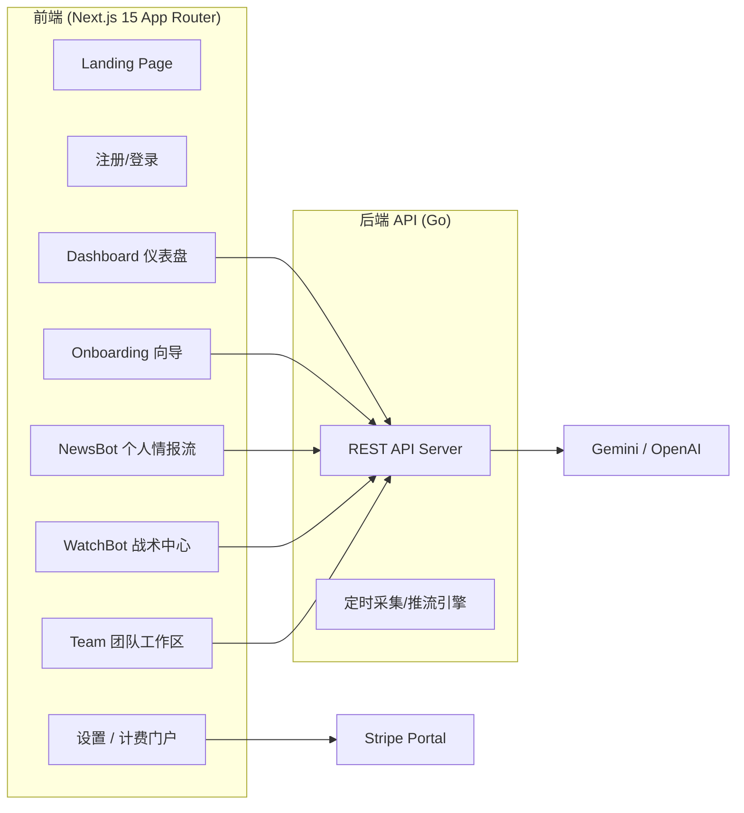

# DevKit Suite 前端设计文档

> 本文档定义 DevKit Suite 统一前端的页面结构、交互设计、技术选型和组件规范。
> 配合全面升级的产品定义，新版前端不仅包含查阅功能，更注重 **Onboarding（入驻体验）**和**团队协作**。

---

## 一、整体架构

### 1.1 系统全景



### 1.2 高阶前端技术选型

| 层级 | 选型 | 理由 (SaaS 级体验) |
|------|------|--------------------|
| **框架** | Next.js 15 (App Router) | React Server Components 极大提升首屏加载速度 |
| **语言** | TypeScript | 企业级重构与代码提示必备 |
| **样式** | Tailwind CSS 4 | 原子级 CSS，支持高度定制的暗黑主题体系 |
| **UI库** | shadcn/ui | 高端质感、无头组件化、内置无障碍设计(a11y) |
| **图标库** | lucide-react | 线条极简现代风，搭配 SaaS 工具绝佳 |
| **动画** | framer-motion | 提供平滑的下拉、展开、悬浮反馈（Micro-interactions） |
| **状态/数据** | Zustand + TanStack Query | 服务端状态缓存极佳，处理实时更新无需手动 reload |
| **图表可视化** | Recharts | 战术卡片 (Battlecards) 趋势统计图必备 |
| **主题切换** | next-themes | P0级：支持纯粹的暗色(Dark)或跟随系统设置 |

---

## 二、页面与全新交互流设计

### 2.1 🚀 Onboarding (新用户引导) - "Aha Moment"

> 目标：绝不让用户第一眼看到空荡荡的 Dashboard。

```
┌──────────────────────────────────────────────────────────┐
│  欢迎来到 DevKit Suite！请问你主要关注哪个细分领域？       │
│                                                          │
│  [  AI 大模型 (LLM)         ]                            │
│  [  开发者工具 (DevTools)   ]  ← (用户勾选)                  │
│  [  SaaS / CRM              ]                            │
│  [  其他                    ]                            │
│                                                          │
│  下一步：我们为你挑选了以下头部竞品，一键开始监控！        │
│                                                          │
│  ☑ Vercel (定价页 / 功能页)                             │
│  ☑ Supabase (整个站点)                                  │
│  ☑ Cursor (Changelog)                                   │
│                                                          │
│  [ ✅ 一键追踪 3 个竞品并进入控制台 ]                      │
└──────────────────────────────────────────────────────────┘
```

### 2.2 WatchBot — 全局战术中心 (Battlecards)

> 一眼看清自己和所有竞品的优劣势与最新异动。

```
┌─────────┬────────────────────────────────────────────────┐
│  侧栏   │  ⚔️ 战术卡片 (Battlecards)             [导出 PDF] │
│         ├────────────────────────────────────────────────┤
│         │                                                │
│         │  近期高优情报预警（近 7 天）                    │
│         │  🔴 [Pricing] Supabase 上调了 Pro 版存储计费     │
│         │  🟡 [Feature] Cursor 集成了最新的 Claude 3.5  │
│         │                                                │
│         │  竞品横向对比矩阵 (自动生成)                     │
│         │  ┌────────────┬───────────┬───────────┬─────┐  │
│         │  │ 维度       │ 我们自己  │ Supabase  │Vercel│  │
│         │  │ 入门价格   │ $10/mo    │ $29/mo    │$20/mo│  │
│         │  │ 核心卖点   │ LLM 原生  │ Postgres  │ 全栈 │  │
│         │  │ 最近大动作 │ 接入Agent │ 缓存降价  │v0升级│  │
│         │  └────────────┴───────────┴───────────┴─────┘  │
│         │                                                │
│         │  [查看 Vercel 详细时间线 ▸]                     │
└─────────┴────────────────────────────────────────────────┘
```

### 2.3 WatchBot — 智能报警设置 (Smart Alerts)

> 只接收真正重要的变更（防干扰神器）。

```
┌─────────┬────────────────────────────────────────────────┐
│  侧栏   │  ⚙️ 报警设置                                   │
│         ├────────────────────────────────────────────────┤
│         │                                                │
│         │  监控对象：Supabase /pricing                     │
│         │                                                │
│         │  触发条件 (IF)：                                │
│         │  ● 仅当改动重要性达到：[ Critical (红色) ▾ ]     │
│         │  ○ 仅当页面文本新增关键词："Enterprise", "AI"    │
│         │  ○ 仅当探测到价格数字变化时                      │
│         │                                                │
│         │  执行动作 (THEN)：                               │
│         │  ☑ 发送邮件至团队 (team@mycompany.com)           │
│         │  ☑ 推送至 Slack 频道 (#competitor-intel)         │
│         │                                                │
│         │                                [保存智能规则]    │
└─────────┴────────────────────────────────────────────────┘
```

### 2.4 Team Workspaces (团队空间与协作)

```
┌─────────┬────────────────────────────────────────────────┐
│  侧栏   │  👥 团队与席位管理                              │
│         ├────────────────────────────────────────────────┤
│         │                                                │
│         │  当前团队： Acme Corp (Pro Plan: 2/5 席位)      │
│         │                                                │
│         │  成员列表：                                     │
│         │  ┌────────────────────────────────────────┐    │
│         │  │ Robin (Owner)      robin@acme.com      │    │
│         │  │ Alice (Viewer)     alice@acme.com  [移除]│    │
│         │  └────────────────────────────────────────┘    │
│         │                                                │
│         │  邀请新成员：                                   │
│         │  [ 输入邮箱地址... ]     [邀请加入 (消耗 1 席位)]│
│         │                                                │
│         │  共享资产：                                     │
│         │  ☑ 共享 WatchBot 竞品配置与报告                 │
│         │  ☑ 共享 NewsBot 内网知识库(收藏夹)              │
└─────────┴────────────────────────────────────────────────┘
```

### 2.5 变更详情中的评论协作流

```
┌─────────┬────────────────────────────────────────────────┐
│  侧栏   │  旧内容               新内容                    │
│         │  $20 / user         $25 / user                 │
│         │                                                │
│         │  💬 团队评论讨论 (1)                            │
│         │  ┌────────────────────────────────────────┐    │
│         │  │ 🙍 Robin: @Alice 他们涨价了，我们是不是     │    │
│         │  │ 可以借机发一波营销邮件切他们的用户？         │    │
│         │  │                                        │    │
│         │  │ [回复输入框...]                           │    │
│         │  └────────────────────────────────────────┘    │
└─────────┴────────────────────────────────────────────────┘
```

---

## 三、开发执行路径 (前端视角)

| 阶段 | 周期 | 页面交付 | 重点技术拆解 |
|------|------|----------|------------|
| **Phase 1: 门面与框架** | 第 1 周 | Landing Page, 登录/注册, 主 Layout | 集成 Tailwind v4, 鉴权(NextAuth), 响应式侧边栏 |
| **Phase 2: 核心浏览与 Aha**| 第 2 周 | Onboarding 向导, 极简 Dashboard, 基础竞品树形查看, Markdown 详情 | Framer-motion 实现优雅进入, Zustand 管理浏览状态 |
| **Phase 3: Diff 与高级图表**| 第 3 周 | 并排 Diff Viewer, 战术卡片 (Battlecards), 活动流 (Activity Feed) | Recharts 图表渲染, 虚拟滚动(Virtual Scroll)加载超长 Diff |
| **Phase 4: 团队与商业化门户**| 第 4 周 | 团队管理页, 智能报警设置, 计费 Stripe 跳转 | 角色拦截路由守卫 (Admin/Viewer), 表单校验 (Zod) |
