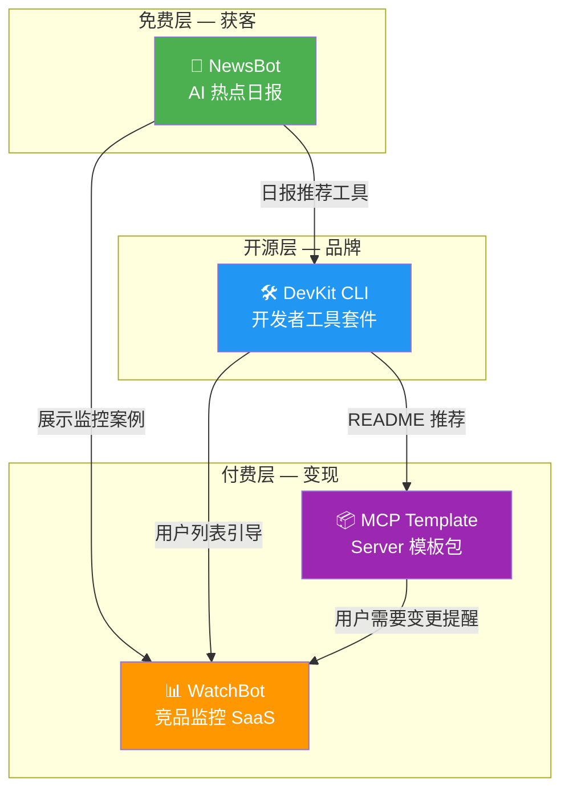

# 产品矩阵详细设计文档 — 总览

> 本文档是四大产品的总览和共享基础设施设计。各产品的详细设计见独立文档。

## 📋 文档索引

| 文档 | 说明 |
|------|------|
| [product_1_newsbot.md](./product_1_newsbot.md) | 产品 1：AI 热点日报 Bot |
| [product_2_devkit.md](./product_2_devkit.md) | 产品 2：开发者 CLI 工具套件 |
| [product_3_mcp_template.md](./product_3_mcp_template.md) | 产品 3：MCP Server 模板包 |
| [product_4_watchbot.md](./product_4_watchbot.md) | 产品 4：竞品监控 Bot |
| [shared_infrastructure.md](./shared_infrastructure.md) | 共享基础设施 + 部署 + 商业化 |

---

## 🎯 产品矩阵全景



## 🏗️ 统一技术栈

| 层级 | 选型 | 说明 |
|------|------|------|
| **语言** | Go 1.25 | 单二进制、高并发、你最熟悉 |
| **LLM 调用** | OpenAI / Gemini / Claude API | 多模型切换，Ollama 本地备选 |
| **数据库** | SQLite（MVP）→ PostgreSQL（生产） | 零运维启动 |
| **缓存** | 内存 → Redis（按需） | 初期不需要 |
| **前端** | Next.js（WatchBot 仪表盘） | 仅竞品监控需要 Web UI |
| **部署** | Docker + VPS（$5/月 Hetzner） | 初期一台机器全搞定 |
| **CI/CD** | GitHub Actions | 自动构建 + 发布 |
| **支付** | Stripe / Paddle / Gumroad | 按产品选用 |
| **监控** | Prometheus + Grafana（可选） | 后期加 |

## 📁 Monorepo 项目结构

```
devkit-suite/
├── cmd/                             // 各产品入口
│   ├── newsbot/main.go              // 产品 1
│   ├── devkit/main.go               // 产品 2
│   └── watchbot/main.go             // 产品 4
├── pkg/                             // 共享库（对外可用）
│   ├── llm/                         // LLM 多模型封装
│   ├── scraper/                     // 爬虫引擎
│   ├── differ/                      // Diff 引擎
│   ├── notify/                      // 通知（Telegram/Slack/Email/Webhook）
│   └── storage/                     // 存储抽象层
├── internal/                        // 内部包（不对外暴露）
│   ├── newsbot/                     // 产品 1 业务逻辑
│   ├── devkit/                      // 产品 2 业务逻辑
│   └── watchbot/                    // 产品 4 业务逻辑
├── templates/                       // 产品 3：MCP 模板包
│   └── mcp-server/
├── web/                             // 产品 4 前端
│   └── watchbot-dashboard/
├── deploy/
│   ├── docker/
│   ├── k8s/
│   └── scripts/
├── docs/
├── configs/
├── Makefile
├── go.mod
└── README.md
```

## ⏱️ 12 周里程碑

| 周 | 重点 | 产出 | 验证标准 |
|----|------|------|---------|
| 1 | NewsBot MVP | Telegram Bot 每天推送 | ≥50 订阅 |
| 2 | DevKit commit | `devkit commit` 可用 | 本地测试通过 |
| 3 | DevKit review+doc | 3 个命令可用 | GitHub 发布 |
| 4 | DevKit 推广 | README + demo GIF | ≥100 Star |
| 5 | MCP 框架提取 | 从 robotIM 重构 | 独立运行通过 |
| 6 | MCP 模板完善 | 4 个示例 Tool + 文档 | Gumroad 上架 |
| 7 | WatchBot 爬虫 | 页面抓取+diff 引擎 | 3 个测试站点 |
| 8 | WatchBot 分析 | LLM 分析+报告 | 输出 JSON 准确 |
| 9 | WatchBot UI | Web 仪表盘 | 用户可注册使用 |
| 10 | WatchBot 商业化 | Stripe + Landing Page | 首笔订单 |
| 11 | 交叉推广 | 四产品互相引流 | 转化率 >2% |
| 12 | 优化迭代 | 根据用户反馈调整 | NPS >30 |
