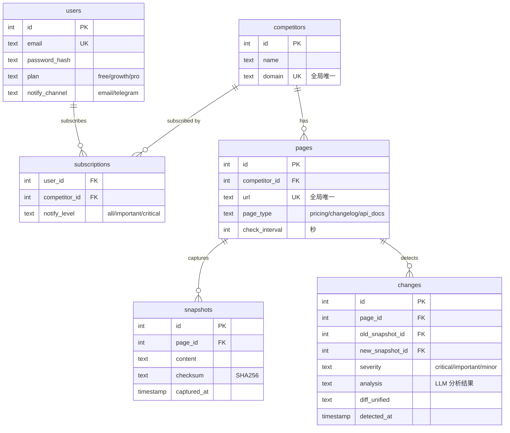

# WatchBot 多用户架构改造

## 问题

当前 MVP 是单用户硬编码模式。多用户场景下有两个关键问题：

1. **重复抓取**：用户 A、B、C 都监控竞品 X，X 被抓取 3 次（浪费资源 + 对目标不友好）
2. **通知轰炸**：同一轮检查中竞品 A、B、C 都有变化，用户收到 3 条消息（应合并为 1 条摘要）

## 设计原则

```
抓取全局去重  ·  快照共享存储  ·  订阅多对多  ·  通知按用户聚合
```

## 架构

### 数据模型



> [!IMPORTANT]
> **核心变化**：`competitors` 和 `pages` 是全局表（不绑定 user_id），通过 `subscriptions` 实现多对多。同一竞品无论多少人订阅，只抓取 1 次、存储 1 份快照、分析 1 次 LLM。

### 检查流程

```
  ┌─────────────────────────────────────────┐
  │         Scheduler (定时调度)              │
  │   收集所有 pages 表中待检查的 URL          │
  │   按 URL 去重，每个 URL 只出现一次         │
  └────────────────┬────────────────────────┘
                   │
  ┌────────────────▼──────────────────────────────────────┐
  │  Phase 1: 全局抓取 + Diff (per URL, NOT per user)     │
  │                                                        │
  │  for each unique page:                                 │
  │    1. Fetch(url) → content                             │
  │    2. Compare checksum with latest snapshot             │
  │    3. If changed: save snapshot + compute diff          │
  │    4. If changed + LLM configured: analyze diff        │
  │    5. Save change record to `changes` table            │
  └────────────────┬──────────────────────────────────────┘
                   │
  ┌────────────────▼──────────────────────────────────────┐
  │  Phase 2: 按用户聚合通知 (per user, NOT per change)    │
  │                                                        │
  │  changes_this_round = all changes from Phase 1         │
  │                                                        │
  │  for each user with active subscriptions:              │
  │    1. Filter: user's subscribed competitors' changes   │
  │    2. Filter: severity ≥ user's notify_level           │
  │    3. If any: compose ONE digest notification          │
  │    4. Send single message to user                      │
  └────────────────────────────────────────────────────────┘
```

### 聚合通知格式

一个用户订阅了 A、B、C 三个竞品，本轮 A 和 C 有变化，合并为 **一条消息**：

```
🔔 竞品监控报告 — 2026-02-20

检测到 2 个竞品发生变化：

🔴 [Critical] OpenAI API Docs
新增 claude-compatible endpoint，疑似兼容策略调整。
建议：评估是否需要跟进兼容层。
📊 +15 / -3 行 · 🔗 链接

🟡 [Important] Anthropic Changelog
Claude 4 Sonnet 发布，上下文窗口扩展到 256K。
建议：更新模型对比文档。
📊 +42 / -0 行 · 🔗 链接

---
未变化：Gemini API Docs ✅
```

### 模块变化

| 模块 | 当前 | 改造后 |
|------|------|--------|
| `cmd/watchbot/main.go` | 硬编码 5 个目标 | CLI: `add/remove/list` 竞品 + `check/serve` |
| `internal/watchbot/watchbot.go` | 单目标 Pipeline | `GlobalPipeline` 全局调度 |
| **[NEW]** `internal/watchbot/store.go` | 内存 map | SQLite 持久化 (全部表) |
| **[NEW]** `internal/watchbot/digest.go` | — | 按用户聚合 changes → 单条通知 |
| `pkg/scraper` | 不变 | 不变 |
| `pkg/differ` | 不变 | 不变 |
| `pkg/notify` | Telegram only | 复用 NewsBot 邮件基础设施 |

### 智能输入处理

`watchbot add` 支持两种输入方式：直接 URL 或自然语言描述。

```
用户输入  ──→  是 URL 格式？
               │
               ├── 是 → URL 校验 + 标准化 → 添加
               │
               └── 否 → 当作自然语言 → LLM 推理 URL
                     │
                     ├── 推理出 URL → 展示候选 → 用户确认 → 添加
                     └── 推理失败 → 提示用户输入具体 URL
```

#### URL 输入校验

| 用户输入 | 问题 | 自动处理 |
|---------|------|---------|
| `openai.com` | 缺 scheme | 自动补 `https://` |
| `https://openai.com/` | 尾部斜杠 | 标准化去除 |
| `https://openai.com/pricing#section` | 带锚点 | 去除 fragment |
| `https://nonexistent.xyz` | 域名无法解析 | DNS 检查 → 报错 |
| `https://openai.com/404page` | 404 响应 | HTTP 状态码检查 → 报错 |
| `https://openai.com/login` | 需登录 | 检测内容长度 → 警告 |
| `ftp://xxx` | 非 HTTP | 协议白名单 → 报错 |
| 空字符串 | 无输入 | 提示用法 |

#### 自然语言 → URL 解析（三层 Fallback）

**不做聊天、不做多轮对话**。三层策略解析用户意图：

```
用户输入 "监控 Gemini API"
    │
    ▼
① LLM 回忆（零成本，训练数据中的 URL）
    ├── 有 URL + high confidence → HTTP 验证 → 用户确认
    └── 无 URL 或 low confidence ──▶ ②
                                      │
② Google Custom Search（100 次/天免费）
   搜索 "Gemini API documentation official site"
    ├── 搜到 → 用户确认
    └── 失败/超限 ──▶ ③
                       │
③ Bing Web Search（1000 次/月兜底）
    ├── 搜到 → 用户确认
    └── 仍失败 → 提示用户手动输入 URL
```

> [!NOTE]
> 日常 99% 在第①层解决（主流产品 URL 在训练数据里）。搜索 API 只在小众产品时触发，成本接近零。

**第①层 LLM Prompt**：

```go
prompt := `你是竞品监控助手。用户想添加一个监控目标。

用户输入："%s"

你的任务：
1. 理解用户想监控哪个产品/公司的什么类型页面
2. 根据你的知识，给出该产品最可能的官方页面 URL
3. 如果你不确定 URL，在 urls 中留空，只返回 name

注意：
- 只返回你有高置信度的 URL，不要编造
- 如果用户输入与监控需求无关（如闲聊），返回 error

返回 JSON：
成功：{"name": "产品名", "urls": ["URL"], "page_type": "api_docs/pricing/changelog", "confidence": "high/low"}
失败：{"error": "无法识别监控目标"}`
```

**LLM 返回后必须 HTTP 验证**：即使 LLM 返回了 URL，也要 `HEAD` 请求检查状态码，防止编造的 URL。

交互示例：

```bash
# 自然语言 → LLM 推理 → 用户确认
$ watchbot add "监控 Gemini API 变化"
🤖 理解您的需求，建议监控：
  [api_docs] Gemini API Reference
  https://ai.google.dev/gemini-api/docs
确认添加？[Y/n]: y
✅ 已添加

# 无法识别 → 友好提示
$ watchbot add "你好"
❌ 无法识别监控目标，请提供具体信息，例如：
   watchbot add "监控 OpenAI API 文档变化"
   watchbot add https://openai.com/pricing

# 直接 URL → 校验后添加
$ watchbot add https://stripe.com/pricing
✅ 已添加: Stripe Pricing (https://stripe.com/pricing)
```

### CLI 命令设计

```bash
# 竞品管理（支持 URL 或自然语言）
watchbot add "监控 OpenAI 的 API 变化"          # 自然语言
watchbot add https://stripe.com/pricing          # 直接 URL
watchbot add --name="OpenAI" --domain=openai.com # 自动发现关键页面
watchbot remove --name="OpenAI"
watchbot list                                     # 列出所有竞品及页面

# 用户管理（复用 NewsBot 模式）
watchbot subscribe --email=user@x.com --competitors="OpenAI,Anthropic"
watchbot unsubscribe --email=user@x.com

# 运行
watchbot check      # 单次全量检查 + 聚合通知
watchbot serve      # 守护进程，每 6h 自动 check
```

### 抓取去重逻辑

```go
// GlobalPipeline.RunCheck
func (gp *GlobalPipeline) RunCheck(ctx context.Context) error {
    // Phase 1: 全局抓取（按 URL 去重）
    pages, _ := gp.store.GetAllActivePages()  // 全局所有页面
    var changesThisRound []Change

    for _, page := range pages {
        // 每个 URL 只抓取一次
        change, err := gp.checkPage(ctx, page)
        if err != nil { continue }
        if change != nil {
            changesThisRound = append(changesThisRound, *change)
        }
    }

    // Phase 2: 按用户聚合通知
    users, _ := gp.store.GetActiveSubscribers()
    for _, user := range users {
        // 筛选该用户订阅的竞品的变化
        userChanges := filterBySubscription(changesThisRound, user)
        if len(userChanges) == 0 { continue }

        // 合并为一条摘要通知
        digest := gp.composeDigest(userChanges, user)
        gp.sendDigest(ctx, digest, user)
    }
    return nil
}
```

### 搜索 API 接入

搜索 API 用于自然语言 URL 解析的第②③层 fallback，**直接 HTTP 调用，不走 MCP**。

| 层级 | API | 免费额度 | 调用方式 |
|------|-----|---------|---------|
| ② 主 | Google Custom Search | 100 次/天 | `GET googleapis.com/customsearch/v1?q=...&key=...` |
| ③ 备 | Bing Web Search | 1000 次/月 | `GET api.bing.microsoft.com/v7.0/search?q=...` |

搜索词由程序拼接，不需要 LLM 处理：

```go
query := fmt.Sprintf("%s official documentation site", productName)
```

搜索结果直接取第一条 URL，不需要 LLM 再筛选。

### MCP 定位（V2）

搜索 API 直接 HTTP 调用，不通过 MCP。MCP 的价值在于**把 WatchBot 暴露为工具**，让外部 AI Agent 能调用：

```go
// V2: 注册 WatchBot 为 MCP Tool
server.RegisterTool(mcpserver.Tool{
    Name:        "watchbot_add_monitor",
    Description: "添加竞品监控目标",
    Execute: func(args map[string]any) (any, error) {
        return watchbot.AddMonitor(args["name"], args["url"])
    },
})
```

```
AI Agent: "帮我监控 Stripe 的定价页变化"
    ↓ MCP Tool Call
WatchBot.addMonitor(name="Stripe", url="https://stripe.com/pricing")
```

> [!NOTE]
> V1 不做 MCP 集成。V2 再考虑把 WatchBot 暴露为 MCP Tool。

### 数据量估算

| 场景 | 100 用户 | 1000 用户 |
|------|---------|---------|
| 平均每人 3 个竞品 | 300 订阅 | 3000 订阅 |
| 去重后唯一竞品 | ~80 个 | ~300 个 |
| 每竞品 3 个页面 | 240 URL | 900 URL |
| **每轮抓取次数** | **240 次** ✅ | **900 次** ✅ |
| 无去重时抓取次数 | 900 次 ❌ | 9000 次 ❌ |
| **节省** | **73%** | **90%** |

---

## 模块变化

| 模块 | 当前 | 改造后 |
|------|------|--------|
| `cmd/watchbot/main.go` | 硬编码 5 个目标 | CLI: `add/remove/list/subscribe/check/serve` |
| `internal/watchbot/watchbot.go` | 单目标 Pipeline | `GlobalPipeline` 全局调度 |
| **[NEW]** `internal/watchbot/store.go` | 内存 map | SQLite 持久化 (6 张表) |
| **[NEW]** `internal/watchbot/digest.go` | — | 按用户聚合 changes → 单条通知 |
| **[NEW]** `internal/watchbot/resolver.go` | — | 自然语言 → URL（LLM + Google + Bing） |
| **[NEW]** `internal/watchbot/validator.go` | — | URL 校验 + 标准化 |
| `pkg/scraper` | 不变 | 不变 |
| `pkg/differ` | 不变 | 不变 |
| `pkg/notify` | Telegram only | + 复用 NewsBot 邮件 |

## Verification Plan

```bash
# 构建
go build -o bin/watchbot ./cmd/watchbot

# 添加竞品（直接 URL）
./bin/watchbot add https://platform.openai.com/docs/changelog

# 添加竞品（自然语言）
./bin/watchbot add "监控 Anthropic API 文档变化"

# 订阅
./bin/watchbot subscribe --email=414108176@qq.com --competitors="OpenAI,Anthropic"

# 运行两次（第一次建立基线，第二次检测变化）
./bin/watchbot check
sleep 5
./bin/watchbot check  # 验证聚合通知（应收到 1 封而非 N 封）

# 验证去重
./bin/watchbot subscribe --email=test@x.com --competitors="OpenAI"
./bin/watchbot check  # OpenAI 页面只抓取 1 次，两个用户各收 1 封
```
